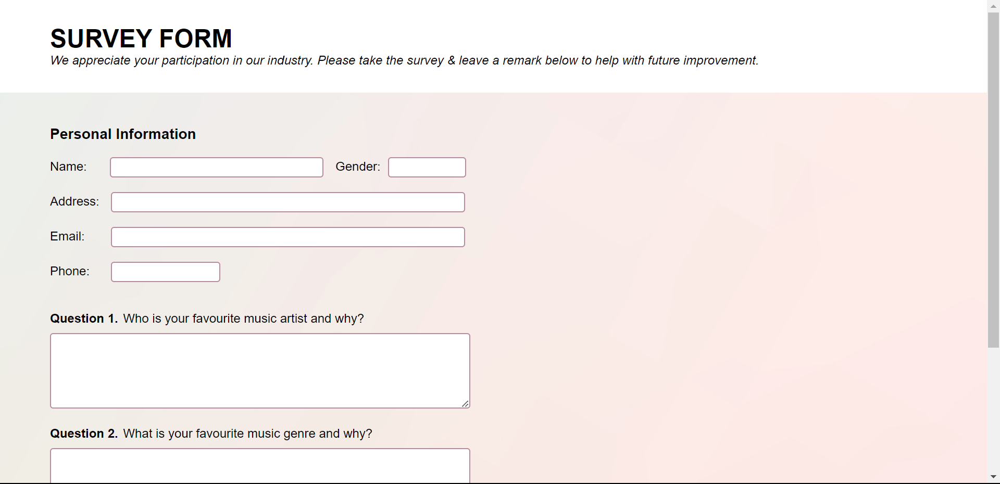
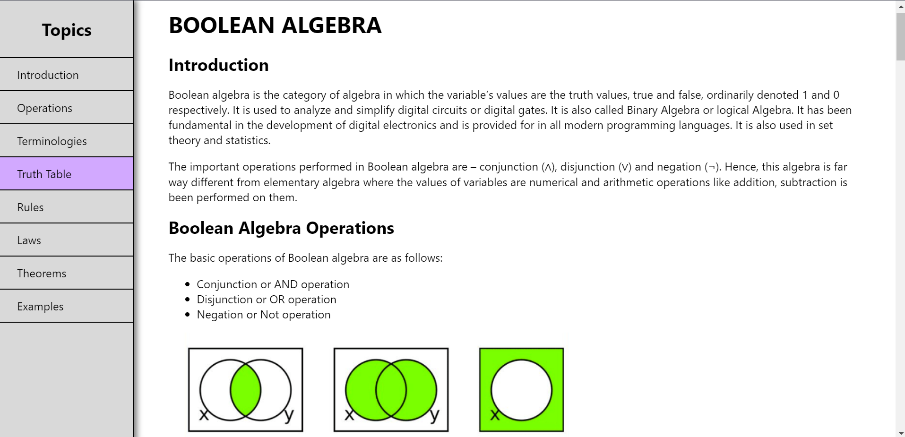

##HTML-CSS BASICS

A collecttion of html and css basic websites for beginners along with source code.
 
Author-Karan Dugar.
  
1.Tribute Page
  

  
2.Survey Form
  

  
3.Technical Documentation
  

 
Note : Aditional feature of a hiding nav bar can be added.